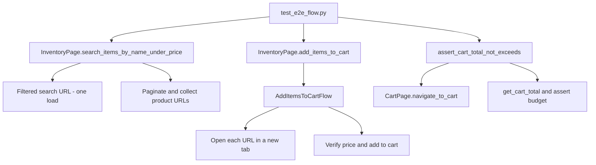

# Ness Assignment — eBay E2E Automation

Playwright + Python automation for eBay: search with price filter, add items to cart, verify cart total.

## Prerequisites

- Python 3.11+

## Setup

```bash
pip install -r requirements.txt
playwright install chromium
```

Copy `.env.example` to `.env` and set `EBAY_URL`, `EBAY_USERNAME`, and `EBAY_PASSWORD` if login is required.

## Run tests

```bash
pytest tests/test_e2e_flow.py
```

Test data is loaded from `data/test_data.json` (search query, max price, item limit).

## AI bug review

The assignment’s static code-review task (identify buggy AI-generated test code and propose fixes) is documented in [`ReadMeAIBugs.md`](ReadMeAIBugs.md). It covers five issues — mixed Selenium/Playwright imports, missing browser lifecycle management, hard-coded sleeps, missing assertions, and fragile teardown — with explanations and corrected code samples.

## Test reports

Each run writes reports under `reports/` (gitignored):

- **HTML** — `reports/report.html` (open in your browser)
- **JUnit XML** — `reports/junit.xml` (for CI tools, Azure DevOps, Jenkins, etc.)

## Architecture

The project follows a layered **Page Object Model (POM)** with separate **flow** modules for multi-step orchestration. Pytest drives the browser via Playwright and delegates UI work to page classes.

### Layers

| Layer | Location | Responsibility |
|-------|----------|----------------|
| **Tests** | `tests/` | Entry point, pytest fixtures, markers (`e2e`, `external`) |
| **Flows** | `flows/` | Cross-page workflows (multi-tab add-to-cart, cart verification) |
| **Pages** | `pages/` | Locators and actions for a single eBay screen |
| **Components** | `pages/components/` | Reusable UI pieces (e.g. variant selector) |
| **Utils** | `utils/` | Price parsing, listing filters, screenshots |
| **Config / data** | `config.py`, `data/test_data.json`, `.env` | Timeouts, URLs, credentials, test inputs |

### End-to-end flow



1. **Search & filter** — `InventoryPage` opens a single filtered search URL (`_nkw`, `LH_BIN=1`, `_udhi`), verifies params and sample results, then paginates until up to `items_limit` in-budget product URLs are collected.
2. **Add to cart** — `AddItemsToCartFlow` opens each URL in a new tab, re-checks the price, handles variants where possible, and adds in-budget items until the target count is reached (or the URL pool is exhausted).
3. **Verify cart** — `cart_verification_flow` navigates to the cart, reads the subtotal, saves a screenshot, and asserts the total does not exceed `max_price × items_added`.

### Design notes

- **`BasePage` + `EbayPageMixin`** — Shared load waits and guards for eBay error, captcha, and cart URL detection.
- **Flows vs pages** — Page classes own single-screen behavior; flow modules coordinate multi-tab and cross-page steps so tests stay thin.
- **Data-driven inputs** — Search query, max price, and item limit come from `data/test_data.json`; base URL and credentials come from `.env`.
- **Resilience** — Multiple cart URL and subtotal selectors; captcha-aware cart navigation (direct URL, then header link); auction-only listings skipped during search.
- **Fixtures** — `conftest.py` provides `inventory_page` (navigates to eBay on setup) and `cart_page`. On GitHub Actions, E2E tests are skipped via `pytest_collection_modifyitems`.
- **Reporting** — `pytest.ini` enables self-contained HTML and JUnit XML under `reports/`. Screenshots are saved under `logs/screenshots/` when items are added and on the final cart page.

## Limitations

### External dependency (live eBay)

- Tests run against **production eBay** — there are no mocks or a staging environment.
- eBay DOM and layout changes can break selectors (search results cards, product page, cart summary).
- **Captcha / bot detection** can block search or cart access; the framework detects these pages but cannot bypass them automatically.
- Search results vary by locale, time, and inventory, so runs are not fully deterministic.

### Authentication and cart session

- `LoginPage` exists under `pages/` but is **not wired into the current test** — the flow assumes guest cart behavior.
- Cart totals and currency depend on the target eBay locale (configured via `EBAY_URL`).
- Signed-in vs guest sessions may behave differently (saved carts, prompts, shipping estimates).

### Test scope and assertions

- Only **Buy It Now** listings are targeted; pure auction listings are filtered out.
- The test aims for `items_limit` successful add-to-cart actions, not a fixed set of URLs from search — some candidates are skipped (over budget, variants not resolved, add-to-cart failure).
- The budget assertion checks `cart_total <= max_price × items_added`, using the count of successfully added items (not the search URL count), since live eBay may skip some listings.
- Variant selection is best-effort; listings with complex configurators may be skipped.

### CI and environment

- GitHub Actions **skips E2E tests** when `GITHUB_ACTIONS=true` (see `tests/conftest.py`) to avoid captcha failures — CI validates install and project setup, not live browser runs against eBay.
- Requires Chromium (`playwright install chromium`); headed vs headless mode can affect anti-bot behavior.
- Network latency and eBay rate limiting can cause intermittent timeouts despite configurable wait values in `config.py`.
